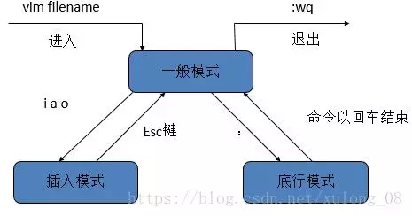

# Vim

### vim 命令
```shell
i #光标前插入  
I #光标当前行插入  
a #光标后插入  
A #光标当前行末尾插入
o #光标当前行的下一行插入  
O #光标当前行的上一行插入  
:w  #保存文本
:q  #退出（在没有修改未保存的情况下）
:wq #保存并退出
shift + zz  #保存退出
:q! #强制退出
:set nu #显示行号
:set nonu #取消行号
gg  #跳到首行
G #跳到尾行
dd  #删除光标所在行
D #删除光标所在处到行尾内容
/word #向后查找word，按n继续
?word #向前查找，按n继续
```
